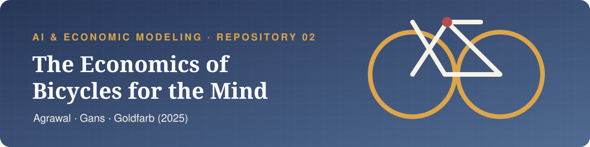

<p align="center">
  
</p>

<p align="center">
  <a href="https://www.nber.org/papers/w34034"></a>
  <a href="https://doi.org/10.3386/w34034"></a>
  <a href="presentation.pdf"></a>
  <a href="extra/presentation-long.pdf"></a>
</p>

<p align="center">
  <a href="presentation.tex"></a>
  <a href="sim.py"></a>
  <a href="LICENSE"></a>
</p>

<p align="center">
  
  
  
  
  
</p>

# Repository 2 — Agrawal, Gans & Goldfarb (2025)

> **Ajay K. Agrawal, Joshua S. Gans y Avi Goldfarb.** *The Economics of Bicycles for the Mind*. NBER Working Paper 34034, julio de 2025. Es un working paper de NBER **sin arbitraje**; no es un paper de arXiv.

## Pregunta y mecanismo

¿Cómo cambian las herramientas cognitivas —computadoras e IA— el esfuerzo, la productividad y la desigualdad cuando sustituyen la habilidad para implementar, pero complementan el juicio humano?

El paper formaliza un único mecanismo: una **cadena de mejoras iterativas**. En cada ronda, el agente encuentra una oportunidad, decide cuánto esfuerzo usar para implementarla y recibe valor si tiene éxito. Una herramienta mejora la implementación o reduce su costo; esto reduce el esfuerzo humano, pero aumenta el beneficio neto de cada oportunidad.

La heterogeneidad tiene tres dimensiones:

- (s): **habilidad de implementación**;
- (alpha): **juicio de resultado**, para reconocer y capturar el valor de una mejora;
- (gamma(t)): **juicio de oportunidad**, para encontrar la siguiente mejora.

## Problema del agente

Condicional en haber encontrado una oportunidad, la única elección es (e_t\ge0):

$$
e_t^*(\theta)\in\arg\max_{e_t\ge0}
\left\{M(e_t;\theta)=\alpha\Delta p(se_t;\theta)-c(e_t;\theta)\right\}.
$$

(p\in[0,1]) es creciente y cóncava; (c) es creciente y convexa. En una solución interior:

$$
\alpha\Delta s\,p'(se_t^*;\theta)=c'(e_t^*;\theta).
$$

El valor total suma el beneficio óptimo sobre la secuencia descontada de oportunidades:

$$
V_0(\theta)=\sum_{t\ge0}
\left(\prod_{i=0}^{t}\gamma(i)\right)\delta^tM(e_t^*(\theta);\theta).
$$

## Proposiciones 1 y 2

**Proposición 1.** Una herramienta cognitiva eleva (p) y/o reduce (c), y hace caer estrictamente la razón marginal (p'/c') cuando mejora (	heta). Bajo una solución óptima bien definida, el esfuerzo cae, es constante entre rondas idénticas y la calidad esperada total aumenta.

**Proposición 2.** La ganancia de adopción es el beneficio adicional por ronda multiplicado por

$$
\Gamma=\sum_{t\ge0}\left(\prod_{i=0}^{t}\gamma(i)\right)\delta^t.
$$

Por eso el valor de la herramienta aumenta con el juicio de oportunidad, aumenta con (alpha) solo si eleva la probabilidad de éxito realizada, disminuye con (s) bajo una sustitución suficientemente fuerte y pondera más las oportunidades tempranas. Las dos últimas comparativas requieren cautelas adicionales, documentadas en [`extensions.md`](extensions.md).

## Proposición 3, corregida

El objeto es la **varianza transversal** de productividad o salario, (operatorname{Var}[V(\theta)]), y la estática comparativa es respecto de la calidad continua de la herramienta (	heta), no “la varianza de la IA”.

Bajo la tecnología especializada (p(se;\theta)=\sqrt{se+\theta}), (c(e)=e); independencia y soporte positivo de (alpha,gamma_0,gamma,s); (deltagamma<1); momentos finitos; (operatorname{Var}(\Gamma/s)>0); y un rango común donde todos permanecen en la solución interior:

- la media (mathbb E[V(\theta)]) aumenta con (	heta);
- si

$$
\frac{\mathbb E[\Gamma^2]}{\mathbb E[\Gamma]^2}
<\mu_s\mathbb E[1/s],
\qquad \Gamma=\frac{\gamma_0}{1-\delta\gamma},
$$

  entonces (operatorname{Var}[V(\theta)]) es estrictamente convexa, cae al inicio y alcanza un mínimo único (	heta^*>0), antes de aumentar;
- afirmar pendiente positiva **específicamente en (	heta=1)** requiere además (	heta^*<1). Esta condición falta en la ecuación (32) del paper.

El beneficio individual de adopción es otro objeto:

$$
V_i(\theta)-V_i(0)=\theta\Gamma_i/s_i,
\qquad
\operatorname{Var}[V(\theta)-V(0)]
=\theta^2\operatorname{Var}(\Gamma/s),
$$

de modo que su varianza aumenta monótonamente para (	heta>0).

## Reproducción

```bash
python -m pip install -r requirements.txt
python sim.py
lualatex presentation.tex
lualatex extra/presentation-long.tex
```

`sim.py` verifica simbólicamente la solución interior y la derivada de la varianza, reproduce un contraejemplo con (	heta^*\approx1.7007), y regenera [`variance-comparison.pdf`](extra/figures/variance-comparison.pdf) y [`variance-comparison.png`](extra/figures/variance-comparison.png).

## Estructura

```text
.
├── assets/
│   ├── header.svg
│   └── agrawal-beamer.sty
├── extra/
│   ├── figures/
│   │   ├── variance-comparison.pdf
│   │   └── variance-comparison.png
│   ├── presentation-long.pdf
│   └── presentation-long.tex
├── hand/
│   └── README.md
├── paper/
│   ├── README.md
│   └── w34034.pdf        # solo local; ignorado por git
├── presentation.pdf
├── presentation.tex
├── README.md
├── extensions.md
├── prompts.md
├── sim.py
├── requirements.txt
├── LICENSE
└── .gitignore
```

La estudiante debe añadir después su propia foto de la comprobación manuscrita en `hand/`; este repositorio no inventa esa evidencia.

## Referencia

Agrawal, A. K., Gans, J. S., & Goldfarb, A. (2025). *The Economics of Bicycles for the Mind*. NBER Working Paper 34034. <https://doi.org/10.3386/w34034>
